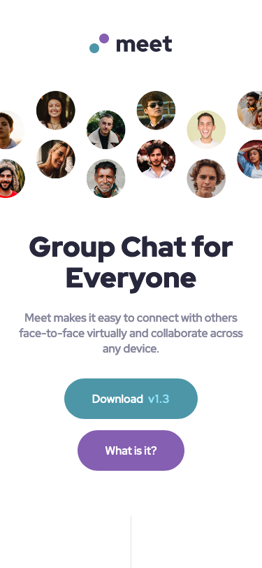
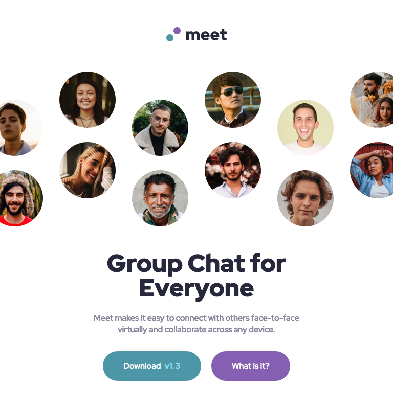
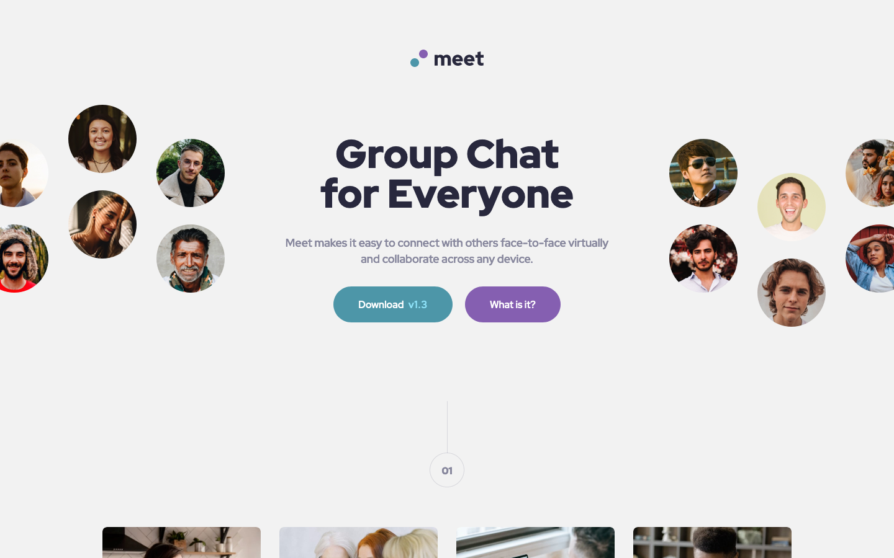

# Frontend Mentor - Meet landing page solution

This is a solution to the [Meet landing page challenge on Frontend Mentor](https://www.frontendmentor.io/challenges/meet-landing-page-rbTDS6OUR). Frontend Mentor challenges help you improve your coding skills by building realistic projects.

## Table of contents

- [Frontend Mentor - Meet landing page solution](#frontend-mentor---meet-landing-page-solution)
  - [Table of contents](#table-of-contents)
  - [Overview](#overview)
    - [The challenge](#the-challenge)
    - [Screenshot](#screenshot)
    - [Links](#links)
    - [Built with](#built-with)
  - [Author](#author)

## Overview

### The challenge

Users should be able to:

- View the optimal layout depending on their device's screen size
- See hover states for interactive elements

### Screenshot

### Links

- Solution URL: [Frontend Mentor](https://www.frontendmentor.io/solutions/meet-landing-page-using-sass-3nWOjTIDX)
- Live Site URL: [Vercel](https://meet-landing-page-lemon-one.vercel.app)

### Built with

- Semantic HTML5 markup
- SASS
- Flexbox
- Mobile-first workflow

## Author

- Frontend Mentor - [@mateuscgoncalves](https://www.frontendmentor.io/profile/mateuscgoncalves)
- Twitter - [Mateus Goncalves](https://www.linkedin.com/in/mateus-gonçalves-577758103/)
  